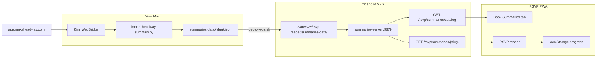

# Headway → RSVP Book Summaries — workflow

How to catch a book summary from [Headway](https://app.makeheadway.com) and publish it to the **Book Summaries** tab on [RSVP Reader](https://zipang.id/rsvp/).

Summaries are **app-wide** (every user sees them). They do **not** go into per-account Library sync. Reading progress is stored locally on each device only.

---

## Architecture



| Piece | Path / URL |
|-------|------------|
| Headway source | `https://app.makeheadway.com/books/{slug}` |
| Extract script | [`scripts/import-headway-summary.py`](scripts/import-headway-summary.py) |
| Local data | [`summaries-data/{slug}.json`](summaries-data/) |
| API server | [`summaries-server.mjs`](summaries-server.mjs) on `127.0.0.1:9879` |
| Public API | `https://zipang.id/rsvp/summaries/catalog` and `.../summaries/{slug}` |
| Client | [`summaries.js`](summaries.js) + **Book Summaries** tab in [`reader-app.js`](reader-app.js) |
| Deploy | [`deploy-vps.sh`](deploy-vps.sh) |

---

## Prerequisites

1. **Kimi WebBridge** running and connected:

   ```bash
   ~/.kimi-webbridge/bin/kimi-webbridge status
   # extension_connected: true
   ```

2. **Headway logged in** in your normal browser (Chrome/Brave with WebBridge extension). WebBridge reuses cookies — never put passwords in scripts or JSON.

3. **Python 3** on your Mac (for the import script).

---

## The work — step by step

### 1. Pick a book on Headway

Open Discover or Library on Headway and open a book. Note the **slug** from the URL:

```
https://app.makeheadway.com/books/the-art-of-war
                              ^^^^^^^^^^^^^^^ slug
```

Key points live at:

```
https://app.makeheadway.com/books/{slug}/summary?page=1&mode=reading
https://app.makeheadway.com/books/{slug}/summary?page=2&mode=reading
…
```

### 2. Extract all key points (automated)

From the repo root:

```bash
cd /Users/yoseph/rsvp-reader

python3 scripts/import-headway-summary.py the-art-of-war \
  --title "The Art of War" \
  --author "Sun Tzu"
```

The script will:

1. Attach to your active Headway tab via WebBridge
2. Open `/books/{slug}` and list all `summary?page=N` key points
3. Loop each page, wait ~3s, pull paragraph text from `main p`
4. Write [`summaries-data/the-art-of-war.json`](summaries-data/the-art-of-war.json)

**Tip:** If a chapter duplicates the previous one, increase wait: `--wait 4`

### 3. Review the JSON

Each file must match this shape:

```json
{
  "id": "the-art-of-war",
  "title": "The Art of War",
  "author": "Sun Tzu",
  "source": "headway",
  "type": "summary",
  "addedAt": 1718380800000,
  "totalWords": 2497,
  "chapters": [
    {
      "title": "Outsmarting the brutal onslaught and understanding the key elements of victory",
      "text": "War is no joke…",
      "wordCount": 337
    }
  ]
}
```

Rules:

- `id` = filename without `.json` (URL-safe slug)
- One `chapters[]` entry per Headway key point
- `wordCount` = whitespace-split word count of `text`
- `totalWords` = sum of chapter `wordCount`

### 4. Deploy to production

```bash
bash deploy-vps.sh
```

This rsyncs `summaries-data/` to the VPS, restarts `rsvp-summaries`, and nginx proxies `/rsvp/summaries/` → port 9879.

### 5. Verify

```bash
# Catalog
curl -s https://zipang.id/rsvp/summaries/catalog | python3 -m json.tool

# Full book
curl -s https://zipang.id/rsvp/summaries/the-art-of-war | python3 -c \
  "import sys,json; d=json.load(sys.stdin); print(d['title'], len(d['chapters']), 'chapters')"
```

In the app:

1. Open https://zipang.id/rsvp/
2. **Book Summaries** tab (default) — book should appear
3. Tap it → RSVP through chapters (PageDown / chapter picker in settings)

No sign-in required for summaries.

---

## Manual extraction (WebBridge only)

Use this when you want one section at a time or the script fails.

### Attach to Headway

```bash
curl -s -X POST http://127.0.0.1:10086/command \
  -H 'Content-Type: application/json' \
  -d '{"action":"find_tab","args":{"url":"app.makeheadway.com","active":true},"session":"headway"}'
```

### List key points

Navigate to `https://app.makeheadway.com/books/{slug}`, then:

```bash
curl -s -X POST http://127.0.0.1:10086/command \
  -H 'Content-Type: application/json' \
  -d '{"action":"evaluate","args":{"code":"(() => { const links = [...document.querySelectorAll(\"a\")].filter(a => a.href.includes(\"summary?page=\")).map(a => ({ page: a.href.match(/page=(\\d+)/)?.[1], title: a.innerText.replace(/\\s+/g,\" \").trim().replace(/^\\d+\\s*/, \"\") })); return JSON.stringify(links); })()"},"session":"headway"}'
```

### Extract one section

Navigate to `.../summary?page=N&mode=reading`, wait 2–3s, then:

```bash
curl -s -X POST http://127.0.0.1:10086/command \
  -H 'Content-Type: application/json' \
  -d '{"action":"evaluate","args":{"code":"(() => { const main = document.querySelector(\"main\") || document.body; const paras = [...main.querySelectorAll(\"p\")].map(p => p.innerText.trim()).filter(t => t.length > 15); return JSON.stringify({ text: paras.join(\"\\n\\n\") }); })()"},"session":"headway"}'
```

Copy output into the JSON `chapters` array manually.

---

## Headway page reference

| Page | URL | What to grab |
|------|-----|--------------|
| Discover | `/discover` | Book cards → slug from link |
| Book detail | `/books/{slug}` | Key point titles + `summary?page=N` links |
| Reading | `/books/{slug}/summary?page=N&mode=reading` | Body: `main p` paragraphs (len > 15) |

---

## Agent prompt (paste into Cursor / Grok)

```
Import Headway book "{title}" (slug: {slug}) into RSVP Book Summaries.

1. Check Kimi WebBridge status
2. Run: python3 scripts/import-headway-summary.py {slug} --title "{title}" --author "{author}"
3. Review summaries-data/{slug}.json for duplicate/empty chapters
4. Run: bash deploy-vps.sh
5. Verify: curl https://zipang.id/rsvp/summaries/catalog
```

Example:

```
Import Headway book "Atomic Habits" (slug: atomic-habits) into RSVP Book Summaries.
Author: James Clear
```

---

## Troubleshooting

| Problem | Fix |
|---------|-----|
| WebBridge not connected | Install extension: https://kimi.com/features/webbridge |
| Headway login page | Log in manually in browser; retry |
| Empty / duplicate chapter text | Increase `--wait 4`; re-run single page manually |
| Book not in app after deploy | `curl https://zipang.id/rsvp/summaries/catalog` — check API |
| API returns 404 | On VPS: `systemctl status rsvp-summaries`; nginx needs `location ^~ /rsvp/summaries/` |
| Summary in wrong place | Summaries go in **Book Summaries** tab, not **Library** (+ Article paste) |

---

## What NOT to do

- Do **not** paste Headway text into **Library → + Article** if you want app-wide summaries (that saves to the user's private IndexedDB/sync).
- Do **not** store Headway passwords in repo, scripts, or chat.
- Do **not** commit copyrighted summary text to a public repo without considering licensing (Headway content is for personal/app use on your own VPS).

---

## Adding the next book (checklist)

- [ ] Open book on Headway, note `{slug}`
- [ ] `python3 scripts/import-headway-summary.py {slug} --title "..." --author "..."`
- [ ] Spot-check JSON (7 chapters, no empty `text`)
- [ ] `bash deploy-vps.sh`
- [ ] Confirm on https://zipang.id/rsvp/ → Book Summaries